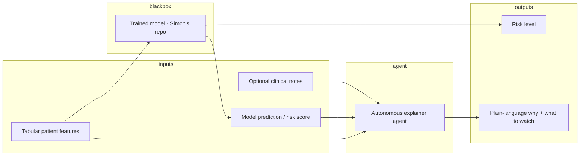

# AI Agent Development Plan

**End goal:** An autonomous AI agent that explains the "black box" of an ML pipeline—how inputs led to a final decision—so non-technical users understand why a patient is at risk of a given disease.

**Near-term goal:** Build an email retrieve-and-summarize agent to learn agent patterns before adapting for medical explainability.

---

## Why the Email Pilot Fits the End Goal

| Skill you need later | What the email agent teaches |
|----------------------|------------------------------|
| Pull data from "your side" (not paste into chat) | Gmail/IMAP or API fetch |
| Autonomous batch (100+ items → fast responses) | Loop over messages, structured JSON out |
| Coded pipeline, not manual Gemini | Python script + agent loop |
| Deploy on your Mac | Local Ollama + optional small service |
| Synthesize opaque input → plain explanation | Summarize threads → "what matters and why" |

The medical agent is the same shape: **tabular/text in → model prediction out → agent explains in human language**.

---

## Problem Statement

- Neural networks are not clear → decisions feel hidden.
- This causes a disconnect between people who need explanations vs. people who build the models.
- **Agent role:** Explain health outcomes for people who need it—not replace the model, but translate it.

**Inputs:** Tabular (and optionally text) patient data.  
**Model output:** Risk prediction.  
**Agent output:** Plain-language synthesis of what is happening under the hood.

---

## End State Architecture



**Simon / project constraints (bake in early):**

- Input/output pairs in code (CSV/JSON), not one-off chat.
- Batch: 100+ pairs → structured responses quickly.
- Any modality later (numbers, text, mixed) via a single ingest → normalize → explain path.
- Pilot on your machine before production commit.
- Simon's repo: input and output already assembled; agent synthesizes between them.

**Roles:**

- **ML model** predicts (PyTorch, optionally `torch.device("mps")` on Mac GPU).
- **LLM agent** explains (e.g. local Ollama)—do not conflate the two.

---

## Phased Plan

### Phase 0 — Foundations (1–2 weeks)

**Goal:** One script you can run that always does the same thing.

1. **Agent skeleton** (extend `agent.py`):
   - System prompt (`system_prompt`)
   - Tool functions (even if fake at first)
   - Simple **ReAct-style loop**: think → call tool → observe → answer

2. **Structured output**
   - Force JSON schema, e.g. `{ "summary", "action_items", "urgency" }` for email
   - Later: `{ "risk_plain", "top_factors", "confidence_note" }` for medical

3. **Local stack**
   - **Ollama** for the explainer LLM
   - **`torch.device("mps")`** when running Simon's PyTorch model locally (inference only)

4. **Environment**
   - Secrets in `.env` (e.g. `GMAIL_PASSWORD`) — never commit
   - `requirements.txt` + README with a single run command

**Exit criterion:** `python agent.py --batch emails.jsonl` prints one JSON line per email.

---

### Phase 1 — Email Agent (Learning Pilot, 2–4 weeks)

**Goal:** Autonomous email agent on your Mac.

| Step | What to build |
|------|----------------|
| 1.1 Retrieve | IMAP or Gmail API: list N messages, fetch body + metadata |
| 1.2 Normalize | Strip HTML, chunk long threads, cap tokens |
| 1.3 Summarize | Agent: thread summary, sender intent, deadlines, suggested reply |
| 1.4 Batch | Read `emails.jsonl` or fetch last 100; write `summaries.jsonl` |
| 1.5 Speed | Start sequential; add parallelism only if needed; cache where useful |

**Optional tools for the agent:**

- `search_emails(query, limit)`
- `get_email(id)`
- `summarize_thread(ids)`

**Autonomous UX mode (daily digest):**

- Build a small local UI (Streamlit is fine) so the agent can run end-to-end without manual chat.
- Default workflow: fetch today's INBOX emails (`q="newer_than:1d"`), summarize, and render a readable digest.
- Keep the email agent read-only (summarize + prioritize only), no auto-replies.
- Reuse the same backend pipeline: fetch -> normalize -> summarize -> validate -> display/write JSONL.
- Add a one-click run plus optional schedule (e.g., every morning) after the manual run is stable.

**Exit criterion:** 100 emails → 100 JSON summaries in one run, no manual chat.

This mirrors Simon's pipeline: **100 I/O pairs in → synthesized text out**.

---

### Phase 2 — Generic I/O Agent (Bridge to Medical, 1–2 weeks)

**Goal:** Agent does not care if the row is an email or a patient.

**Single ingest format:**

```json
{
  "id": "patient_042",
  "inputs": { "age": 67, "bp": 140, "notes": "..." },
  "model_output": { "risk": 0.73, "label": "high" }
}
```

**Prompt template:** "Given inputs and model_output, explain for a non-technical reader…"

**Batch runner** on Simon's pairs when available (same code as email batch, different schema).

**Exit criterion:** Drop in any JSONL with `inputs` + `model_output` → get explanations.

---

### Phase 3 — Medical Explainability Pilot (with Simon's Repo)

**Goal:** Pilot before full commit.

1. **Wire Simon's repo**
   - Load model on `mps` if on Mac
   - Run inference OR use precomputed `model_output` from his pairs
   - Do not retrain in the agent—**explain only**

2. **Explanation quality**
   - Map features to plain language (feature dictionary from Simon)
   - Optional: SHAP/LIME/attention weights as *extra context* for the LLM, not the only explanation
   - Always state: "This is a model estimate, not a diagnosis"

3. **Autonomy**
   - CLI: `python explain.py --pairs data/pairs.jsonl --out explanations.jsonl`
   - No human in the loop per row

4. **Interface for non-technical users** (later)
   - Simple local web UI or Streamlit: one patient row → risk + explanation
   - Keep backend identical to the batch script

**Exit criterion:** Simon reviews 20–50 explanations; iterate on prompt + feature glossary.

---

### Phase 4 — Hardening (After Pilot Works)

- Auth, audit logs, PHI handling if using real patient data
- Latency targets for 100+ rows
- Evaluation rubric (accuracy, clarity, no hallucinated features)
- Deployment beyond laptop (Docker, internal server) if required

---

## Target Codebase Layout

```
agent/
  core/
    loop.py          # agent loop
    llm.py           # Ollama client
    schemas.py       # Pydantic input/output
  tools/
    email.py         # Phase 1
    medical.py       # Phase 3 - load pairs, call model
  runners/
    batch.py         # 100+ JSONL in/out
  prompts/
    email.txt
    medical_explain.txt
```

Email and medical share **`batch.py` + `loop.py`**; only tools and prompts change.

---

## This Week (Concrete Tasks)

1. Fill `agent_instructions` with role + JSON output format for email summaries.
2. Add a **tool stub**: `fetch_recent_emails(n)` returning fake data, then real IMAP.
3. Replace hardcoded demo user message with **batch mode** reading one JSON file.
4. Document: `ollama pull qwen2.5:3b` and run command in README.
5. Ask Simon for: sample **5–10** input/output pairs + which fields are allowed in explanations.

---

## Risks to Watch

| Risk | Mitigation |
|------|------------|
| LLM invents medical reasons | Ground explanations only on provided features + model output; cite feature names |
| "Autonomous" = unsafe actions | Read-only email; medical agent read-only explain, no prescribing |
| Slow on 100+ rows | Smaller model for draft, batch JSON, avoid re-fetching bodies |
| Confusing ML vs agent | Document: **Model scores → Agent narrates** |

---

## Recommended Order

1. Deploy/play locally (Ollama + Python agent loop) ← **current step**
2. Email agent with batch JSONL
3. Generic I/O batch agent
4. Plug in Simon's repo + `mps` inference + explainability prompts
5. Simple UI for non-technical users

---

## Verdict: Is Email-First a Good Plan?

**Yes.** It teaches **retrieve → normalize → agent loop → structured batch output → local deploy**—the same skills Simon needs—without HIPAA and full model integration on week one.
