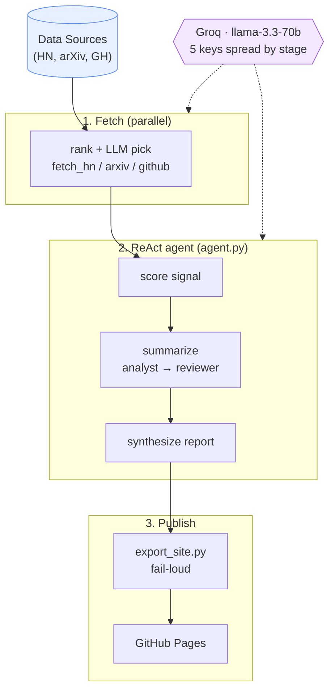

# The Morning AI — System Design

The Morning AI is a daily research briefing that runs on its own. Each morning it scans
Hacker News, arXiv, and GitHub, then a set of Groq-hosted language-model agents score the
candidates, summarize the ones worth keeping, and synthesize them into a single robotics
and embodied-AI briefing that gets published to a GitHub Pages site.

## Architecture

_State flows through append-only JSONL (`items` → `signals` → `summaries` → `report`); triggered daily at 6AM PT via GitHub Actions cron._

## Design notes

- **Three phases:** parallel fetch → sequential ReAct orchestrator → export/deploy.
- **JSONL as state:** each stage writes an append-only file; the ReAct loop re-reads
  `signals.jsonl` / `summaries.jsonl` to track progress (dotted "read" edges).
- **Five Groq keys** spread load across stages to stay under free-tier TPM limits:
  KEY5 fetchers · KEY1 orchestrator · KEY2 scorer · KEY3 analyst/synth · KEY4 reviewer.
- **Analyst → Reviewer critique-hook pattern** inside `summarize_item`: the analyst
  extracts structured hooks (eval setup, named baselines, scope, untested gaps) and the
  reviewer writes a caveat from those hooks rather than the raw article.
- **Fail-loud export:** `export_site.py` exits non-zero if `report.jsonl` is missing,
  empty, or lacks required keys, so CI fails instead of publishing a broken report.
